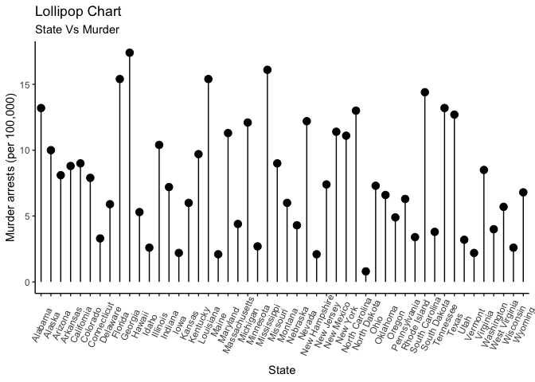

Programming Background
================
Jordan Tanley
6/6/2022

``` r
library(knitr)
knitr::opts_chunk$set(fig.path = "../images/")
```

## 2nd Blog: Programming Background

R was the first programming language I learned back in undergrad, which
I think makes me a bit biased towards it. I love how straighforward R
is. Most of the commands are named exactly what you’d think they’d be,
and the output is concise and to the point. I’ve used SAS quite a bit in
this program at NC State, and for my current job, and I think I’m
starting to enjoy both languages (almost) equally. One thing I’ve missed
about SAS is the ODS output and how user friendly it is in comparison to
Rmarkdown. I’m sure most of my issues with markdown is due to my lack of
understanding of the behind the scenes (which this class will help me
with). When I first learned R, it was in a linear regression course, so
we did some basics of how to read in a dataset, but nothing too
detailed. I think it was a great first programming language to learn, as
it kind of eased me into the world of statistical programming.

## Rmarkdown output

``` r
plot(iris)
```

<!-- -->

rmarkdown::render("\_Rmd/2022-06-06-Second-Blog-Post.Rmd“,
output\_format =”github\_document“, output\_dir =”\_posts",
output\_options = list(html\_preview = FALSE))
