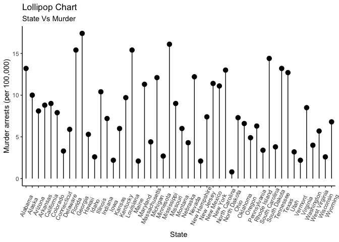

3rd Blog Post
================
Jordan Tanley
2022-06-29

``` r
library(knitr)
knitr::opts_chunk$set(fig.path = "../images/")
```

# 3rd Blog: Coolest Thing I’ve Learned

One of the coolest things I’ve learned about programming in R is how to
use
[`ggplot2`](file:///Users/jordantanley/Downloads/data-visualization%20(2).pdf).
I’d used the package in the past, but never understood what I was doing.
Why all the + signs? What are all these weirdly named functions doing?
Now I have a better grasp of the how and the why behind it all. So
without further ado, here’s an example of some of the concepts of ggplot
that I learned this semester.

# Example using `ggplot2`

``` r
# The initial dataset has state as row names. need to change this
library(tibble)
df <- tibble::rownames_to_column(USArrests, "State")

# set theme and load ggplot2 package
library(ggplot2)
theme_set(theme_classic())

# Plot
ggplot(df, aes(x=State, y=Murder)) + 
  geom_point(size=3) + 
  geom_segment(aes(x=State, 
                   xend=State, 
                   y=0, 
                   yend=Murder)) + 
  labs(title="Lollipop Chart", 
       subtitle="State Vs Murder", y = "Murder arrests (per 100,000)")  + 
  theme(axis.text.x = element_text(angle=65, vjust=0.6))
```

<!-- -->
