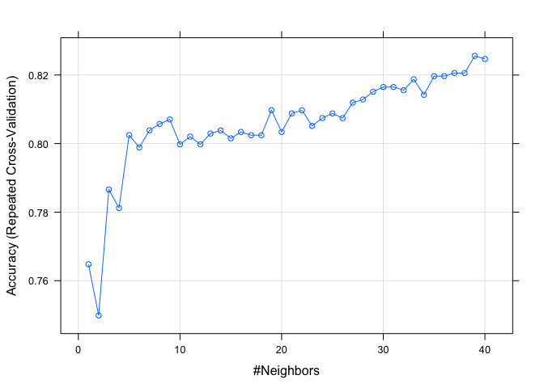

4th Blog Post
================
Jordan Tanley
2022-07-14

# Machine Learning (woot)

### What method did you find most interesting?

I think the method I found most interesting was a supervised learning
method called ‘K Nearest Methods’, or KNN. This method uses the k
closest observations to determine how a point should be classified. It
really uses probabilities:

-   ")=
    proportion of k closest values that are class
      
-   ")=
    proportion of k closest values that are class
    

to predict which class a point belongs to (ie. the one with the highest
probability). The value of

can be hard to choose -

-   too small of a
    
    can lead to overfitting and higher variance,  
-   too large a
    
    can lead to the opposite: underfitting and small variance.

To decide which value of

is best, one can use cross validatioon to use a training/testing sets.

### Example

``` r
library(readr)
library(caret)
library(dplyr)
```

Prepare the data for kNN regression.

``` r
# read in data
heart <- read_csv("../../ST558/heart.csv")
# Create a new variable that is a factor version of the HeartDisease variable
heart$HeartDisease <- as.factor(heart$HeartDisease)
# Remove the ST_Slope variable 
heart <- subset(heart, select = -c(ST_Slope))
# To use kNN we generally want to have all numeric predictors. Create dummy columns corresponding to the values of these three variables for use in our kNN fit
# use dummyVars() and predict() to create new columns. Then add these columns to our data frame and remove the original columns from which these variables were created.
dummies <- dummyVars(~ Sex + ChestPainType + RestingECG + ExerciseAngina, data = heart)
dumvars <- data.frame(predict(dummies, newdata = heart))
hearts <- cbind(heart, dumvars) 
hearts <- select(hearts, -c(Sex, ChestPainType, RestingECG, ExerciseAngina))
set.seed(123)
# Split the data into a training and test set (p = .8)
# indices
train <- sample(1:nrow(hearts), size = nrow(hearts)*.8)
test <- setdiff(1:nrow(hearts), train)
# trainiing and testing subsets
heartTrain <- hearts[train, ]
heartsTest <- hearts[test, ]
```

``` r
# repeated 10 fold cross-validation, with the number of repeats being 3. preprocess the data by centering and scaling. set the tuneGrid so that you are considering values of k of 1, 2, 3, . . . , 40
knnfit <- train(HeartDisease ~ ., data = heartTrain, method = "knn", preProcess = c("center", "scale"),
                trControl = trainControl(method = "repeatedcv", number = 10, repeats = 3), 
                tuneGrid = expand.grid(k = c(1:40)))
# visualize the different 
plot(knnfit)
```

<!-- -->

``` r
# Check how well your model does on the test set using the confusionMatrix() function
confusionMatrix(data = heartsTest$HeartDisease, reference = predict(knnfit, newdata = heartsTest))
```

    ## Confusion Matrix and Statistics
    ## 
    ##           Reference
    ## Prediction  0  1
    ##          0 59 27
    ##          1  8 90
    ##                                           
    ##                Accuracy : 0.8098          
    ##                  95% CI : (0.7455, 0.8638)
    ##     No Information Rate : 0.6359          
    ##     P-Value [Acc > NIR] : 2.087e-07       
    ##                                           
    ##                   Kappa : 0.6127          
    ##                                           
    ##  Mcnemar's Test P-Value : 0.002346        
    ##                                           
    ##             Sensitivity : 0.8806          
    ##             Specificity : 0.7692          
    ##          Pos Pred Value : 0.6860          
    ##          Neg Pred Value : 0.9184          
    ##              Prevalence : 0.3641          
    ##          Detection Rate : 0.3207          
    ##    Detection Prevalence : 0.4674          
    ##       Balanced Accuracy : 0.8249          
    ##                                           
    ##        'Positive' Class : 0               
    ## 

From this output, we can see that according to accuracy, the model with

performed the best.
